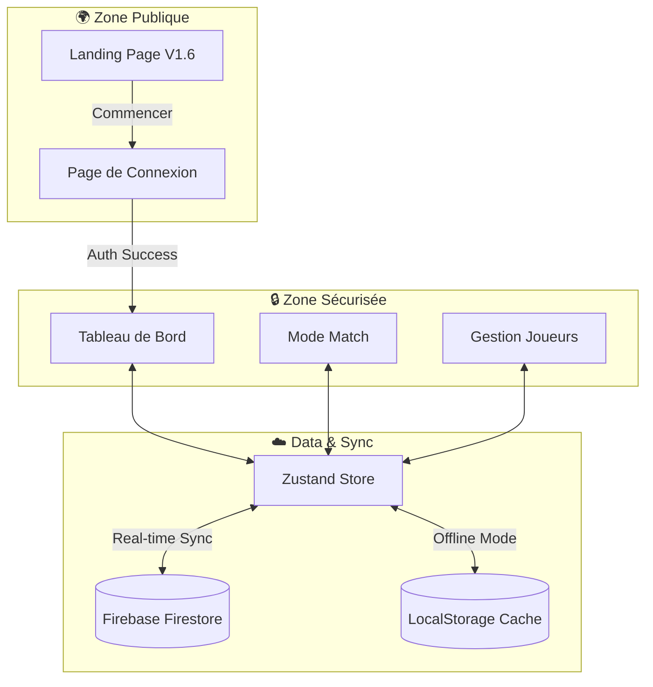

# 🏀 HoopStats - Suivi de Stats de Basket

<p align="center">
  
</p>

Une application web moderne et futuriste pour suivre les statistiques de matchs de basket-ball, conçue pour les parents et les coachs. Créez des joueurs, choisissez votre équipe, et enregistrez les performances en temps réel !

[](https://basket.desimone.fr)
[](https://coolify.io)

## ✨ Fonctionnalités

### 📈 Stats Avancées (V2 - Nouveau !)

- **Évaluation (PIR)** : Calcul automatique de l'indice de performance FIBA/Euroleague affiché en temps réel.
- **True Shooting % (TS%)** : Efficacité réelle aux tirs (inclut les lancers-francs).
- **Effective FG% (eFG%)** : Valorise les tirs à 3 points.
- **Affichage Live** : L'évaluation s'affiche en direct dans le header du match.
- **Carte de Partage Premium** : Visuel exportable avec Points + Évaluation pour les réseaux sociaux.

### 🏆 Gamification & Badges (V1.5)

- **7 Badges Exclusifs** : Sniper (TS%), The Wall (Blocks), Pickpocket (Steals), Maestro (Assists), Cleaner (Rebounds), MVP Perf (PIR), Energizer (0 TO).
- **Calcul Automatique** : Les badges sont attribués en fonction des performances réelles du match.
- **Affichage Contextuel** : Badges visibles dans l'historique des matchs ET sur la carte de partage.
- **Design Premium** : Badges animés avec couleurs distinctives et icônes Lucide.

### 🚀 Landing Page "Quantum" (V1.6)

- **Vitrine Professionnelle** : Page d'accueil immersive style "ESPN/NBA" pour présenter l'application.
- **Animations Hooks** : Effets de parallaxe, ticker défilant, et bento grid interactif.
- **Branding** : Identité visuelle forte "Hoop.Stats" dès la première seconde.
- **Accessibilité** : Point d'entrée clair pour les nouveaux utilisateurs avant la connexion.

### 🎯 UX Polish & Accessibilité (V1.8 - Nouveau !)

- **Standards FFBB** : Abréviations officielles (RB, PD, INT, CTR, BP, F) harmonisées partout.
- **Pédagogie** : Infobulles explicatives sur toutes les stats avancées (y compris FT%) + adaptation intelligente U11 (masquage eFG%).
- **Soft-Delete avec Undo** : Suppression de match avec toast "Annuler" pendant 5 secondes avant suppression définitive.
- **Système de Toast** : Notifications visuelles avec types (succès/erreur/info), icônes, et barre de progression.
- **4 Thèmes** : Mode Sombre, Clair, Système (auto), et Contraste Élevé pour l'accessibilité extérieure.
- **Haptic Feedback** : Vibrations tactiles sur les boutons de score (mobile).
- **Édition Match Améliorée** : Date optionnelle + modification du nom d'adversaire.
- **Empty States** : Illustrations animées sur les pages vides (Dashboard, Joueurs).
- **WCAG 2.2 / RGAA 4** : Focus visible, `prefers-reduced-motion`, contrastes validés, `aria-label` sur les icônes.

### 🔧 Code Quality (V1.9 - Nouveau !)

- **Zustand Auto-Selectors** : Pattern `useGameStore.use.property()` pour des re-renders optimisés.
- **Tailwind CSS v4 Tokens** : `@theme` enrichi avec easings, shadows et spacing sémantiques.
- **Skip-to-main-content** : Lien d'accessibilité WCAG 2.4.1 pour navigation clavier.
- **Composant StatCard** : Extraction et réutilisation des cartes métriques.

### 🎨 Interface "Quantum Court" (V1.4)

- **Design Premium** : Fond noir profond (`#030303`) avec effet "flottant dans le vide".
- **Navigation Floating Island** : Barre de navigation mobile en capsule arrondie avec FAB central.
- **Glass Cards Optimisées** : Panneaux translucides avec animations 3D au survol (`scale` + `translateY`).
- **Graphiques Animés** : Charts Chart.js avec entrées progressives (800ms), gradients dynamiques, et hover interactif.
- **Typographie Stats** : Police monospace dédiée (`.font-stats`) pour les scores et statistiques.
- **Performance** : CSS containment, blur réduit, animations GPU-accelerated.

### ☁️ Synchronisation Cloud (Firebase)

- **Données Privées :** Chaque utilisateur a ses propres joueurs et matchs isolés.
- **Multi-Appareils :** Synchronisation en temps réel entre tous vos appareils.
- **Authentification :** Inscription par email/mot de passe ou connexion Google.
- **Mode Hors-Ligne :** Les données sont mises en cache localement et synchronisées automatiquement au retour de la connexion.
- **Migration Automatique :** Les données locales existantes sont uploadées vers le cloud à la première connexion.
- **Sync Optimisée :** Chargement limité aux 20 derniers matchs pour des performances optimales.

### 🎮 Enregistrement de Match (Mode Arcade)

- **Interface Intuitive & Ergonomique :** Saisie ultra-rapide avec un design "Zéro Scroll". Boutons compacts (cercle cliquable pour incrémenter) et labels positionnés intelligemment (en haut pour la ligne 1, en bas pour la ligne 2).
- **Suivi complet :** Rebonds (Off/Def), Passes, Interceptions, Contres, Balles Perdues, Fautes.
- **Règles U11 Intégrées :** Si un joueur est U11, les tirs à 3 points sont automatiquement masqués (Saisie & Stats).
- **Limite de Fautes :** Avertissement et exclusion automatique (fin de match) confirmée au bout de la 5ème faute.
- **Thème Clair/Sombre :** Interface adaptative avec un mode sombre (néon) et un mode clair (épuré), basculable en un clic.
- **Effets visuels :** Animations "Arcade" avec textes flottants et feedbacks visuels impactants.
- **Ultra-Rapide (Snappy) :** Navigation instantanée sans transitions superflues pour une efficacité maximale.
- **Mobile Optimisé :** Expérience "Native App" (PWA) :
  - **Zéro Zoom :** Saisie stable sans zoom intempestif sur iPhone.
  - **Plein Écran :** Support "Safe Area" (encoches) et masquage des barres navigateur.
  - **Icône :** Prêt à être ajouté sur l'écran d'accueil.
  - **Mode Hors-Ligne :** Bandeau indicateur quand vous êtes déconnecté, données locales préservées.

### 📊 Tableau de Bord (Dashboard)

- **Stats Détaillées :** Nouvelle grille de stats ultra-complète sur 4 colonnes (FG%, 3P%, eFG%, TS%, Eval), identique en live et en historique.
- **Graphiques Intelligents :** Courbes, Camemberts (adaptés U11 sans 3pts), et Barres de progression.
- **Historique :** Liste des matchs avec scores, dates, et accès rapide aux détails.
- **Import/Export :** Sauvegardez vos matchs en JSON pour les archiver (Export) ou rechargez-les depuis un fichier (Import), idéal pour transférer des données entre appareils.

### 📜 Gestion des Matchs & Joueurs

- **Match Setup :** Saisie du nom de l'adversaire.
- **Profils Joueurs :** Gestion complète (Nom, Numéro, Poste, Niveau U11-U18).
- **Partage Résumé :** Copiez un résumé texte complet du match à partager (WhatsApp, Notes, etc.).
- **Correction & Édition :** Mode correction pour annuler les erreurs de saisie et **possibilité de modifier la date** et les stats complètes après le match.
- **UI Optimiste :** L'ajout et la suppression de joueurs sont instantanés (pas d'attente réseau).

## 🏗️ Architecture & Flux Standard



## ⚡ Performance

| Métrique | Avant | Après Optimisation |
|----------|-------|---------------------|
| Bundle Principal | 772 kB | **210 kB** (-73%) |
| Dashboard | 228 kB | **43 kB** (-81%) |
| Chart.js | Bloquant | Lazy-loaded |
| Firebase SDK | Bloquant | Lazy-loaded |

## 🛠 Technologies

- **Frontend :** [React](https://react.dev/) + [Vite](https://vitejs.dev/)
- **Langage :** [TypeScript](https://www.typescriptlang.org/)
- **Styles :** [Tailwind CSS v4](https://tailwindcss.com/)
- **État :** [Zustand](https://github.com/pmndrs/zustand) (avec persistance locale)
- **Backend :** [Firebase](https://firebase.google.com/) (Firestore + Authentication)
- **Graphiques :** [Chart.js](https://www.chartjs.org/) + [React-Chartjs-2](https://react-chartjs-2.js.org/)
- **Icônes :** [Lucide React](https://lucide.dev/)

## 🚀 Installation

1. **Cloner le projet :**

    ```bash
    git clone https://github.com/nickdesi/basketball-stats.git
    cd basketball-stats
    ```

2. **Installer les dépendances :**

    ```bash
    npm install
    ```

3. **Lancer le serveur de développement :**

    ```bash
    npm run dev
    ```

4. **Construire pour la production :**

    ```bash
    npm run build
    ```

5. **Déployer sur Coolify :**

    Ce projet est configuré pour **Coolify** (et tout autre hébergeur supportant Nixpacks) grâce aux fichiers `nixpacks.toml` et `Caddyfile`.
    - Créez une nouvelle ressource "Git Repository".
    - Sélectionnez ce repo.
    - Build Pack : **Nixpacks** (détecté automatiquement).
    - Port : **80** (configuré via Caddy).

## 📱 Utilisation

1. Allez dans l'onglet **Joueurs** pour créer le profil de votre enfant/joueur.
2. Dans **Nouveau Match**, sélectionnez le joueur et le nom de l'adversaire.
3. Pendant le match, cliquez sur les boutons pour ajouter des stats.
4. À la fin du match, cliquez sur "Terminer le match" pour sauvegarder.
5. Consultez les progrès dans le **Tableau de Bord**.

## 🤝 Contribution

Les contributions sont les bienvenues ! N'hésitez pas à ouvrir une issue ou une Pull Request.

## 📄 Licence

MIT License.
