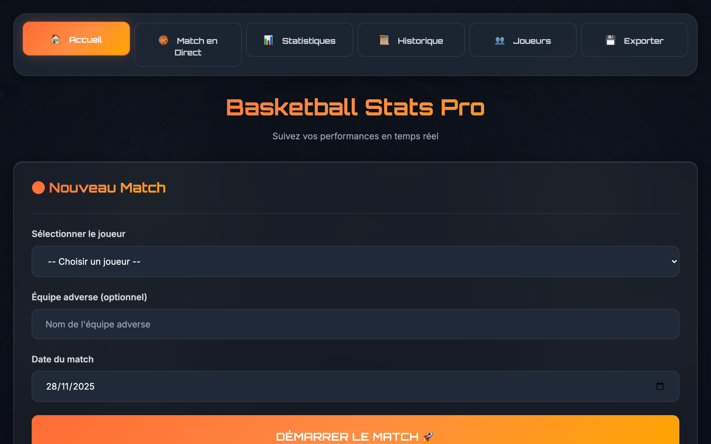

# 🏀 Basketball Stats Pro

Application web moderne pour le suivi des statistiques de basketball en temps réel.


## ✨ Fonctionnalités

- 📊 **Suivi en temps réel** : Enregistrez toutes les actions pendant un match
- 📈 **Graphiques interactifs** : Visualisez vos performances avec Chart.js
- 👥 **Multi-joueurs** : Gérez plusieurs joueurs et leurs statistiques
- 📱 **Responsive** : Optimisé pour smartphone, tablette et desktop
- 💾 **Export/Import** : Sauvegardez vos données en JSON ou CSV
- 🎨 **Design moderne** : Interface ultra moderne avec glassmorphism
- 🇫🇷 **100% Français** : Interface entièrement en français

## 🎯 Statistiques Suivies

- Points (1pt, 2pts, 3pts)
- Rebonds
- Passes décisives
- Interceptions
- Contres
- Balles perdues
- Fautes

## 🚀 Démo en Ligne

Accédez à l'application : **[Basketball Stats Pro](https://votre-username.github.io/basketball-stats/)**

## 💻 Technologies

- HTML5
- CSS3 (Glassmorphism, Animations)
- JavaScript ES6+ (Vanilla)
- Chart.js 4.4.0
- LocalStorage API

## 📦 Utilisation Locale

1. Clonez le repository :
```bash
git clone https://github.com/votre-username/basketball-stats.git
```

2. Ouvrez `index.html` dans votre navigateur

Aucune installation nécessaire ! L'application fonctionne entièrement côté client.

## 📱 Installation comme PWA

L'application peut être installée sur votre smartphone :
1. Ouvrez l'app dans votre navigateur mobile
2. Utilisez "Ajouter à l'écran d'accueil"
3. Profitez de l'expérience app native !

## 🎮 Guide d'Utilisation

### Premier Lancement
1. Accédez à l'onglet **"Joueurs"**
2. Ajoutez un joueur avec son nom, numéro et position
3. Retournez à l'**Accueil**

### Démarrer un Match
1. Sélectionnez le joueur
2. (Optionnel) Ajoutez l'équipe adverse
3. Cliquez sur **"Démarrer le Match"**

### Pendant le Match
- Cliquez sur les boutons d'actions pour enregistrer les stats
- Utilisez **"Annuler"** pour corriger une erreur
- Les stats se mettent à jour en temps réel
- Terminez avec **"Terminer"**

### Analyse des Performances
- **Statistiques** : Visualisez les graphiques et moyennes
- **Historique** : Consultez tous les matchs passés
- **Export** : Sauvegardez vos données

## 📊 Captures d'Écran

### Interface Desktop
### Interface Desktop


### Interface Mobile


## 🗂️ Structure du Projet

```
basketball-stats/
├── index.html          # Page principale
├── styles.css          # Design system
├── app.js              # Contrôleur principal
├── js/
│   ├── players.js      # Gestion joueurs
│   ├── matches.js      # Gestion matchs
│   ├── stats.js        # Statistiques & graphiques
│   └── export.js       # Export/Import données
└── assets/             # Ressources (si besoin)
```

## 🤝 Contribution

Les contributions sont les bienvenues ! N'hésitez pas à :
- Signaler des bugs
- Proposer des nouvelles fonctionnalités
- Soumettre des pull requests

## 📄 Licence

MIT License - Vous êtes libre d'utiliser, modifier et distribuer cette application.

## 👨‍💻 Auteur

Créé avec ❤️ pour les passionnés de basketball

---

**⭐ Si vous aimez ce projet, n'oubliez pas de lui donner une étoile sur GitHub !**
